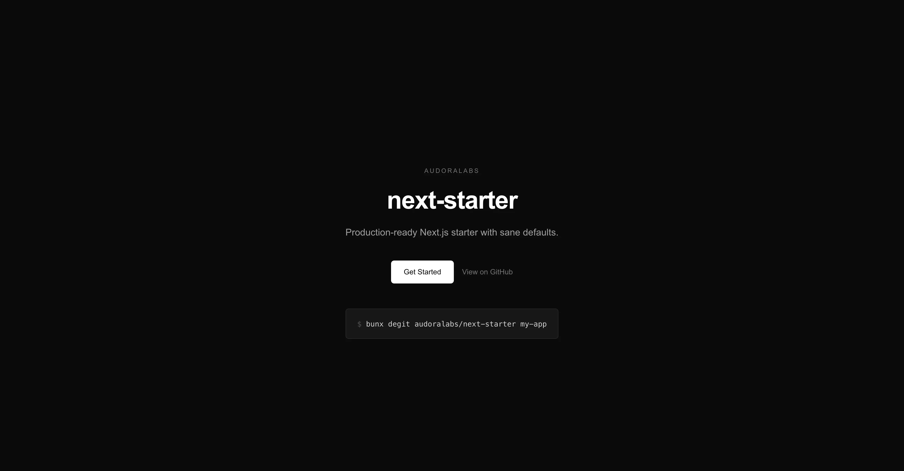
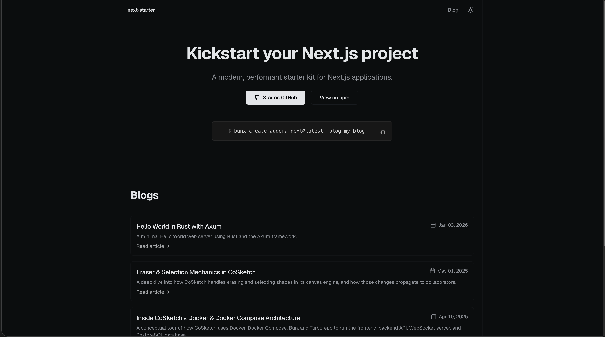

# create-audora-next

Create a new Audora Next.js app with one command.

## Preview

**Base template**



**Blog template**



## Quick Start

```bash
bunx create-audora-next my-app
```

Use `--blog` to create the blog template. Then follow the prompts, or use:

```bash
cd my-app
cp .env.example .env
bun dev
```

Open [http://localhost:3000](http://localhost:3000) to see your app.

## Available Templates

| Template | Status    | Usage                                   |
| -------- | --------- | --------------------------------------- |
| `base`   | Available | `bunx create-audora-next my-app`        |
| `blog`   | Available | `bunx create-audora-next my-app --blog` |

## Base Template Features

- Next.js 16 with App Router & Turbopack
- React 19 with React Compiler
- TypeScript 5 (strict mode)
- Tailwind CSS 4
- Bun runtime
- Open Graph & Twitter Cards
- Structured Data (JSON-LD)
- Dynamic robots.txt & sitemap.xml
- llms.txt for AI assistants
- PWA Manifest
- Security headers
- Dark mode with next-themes
- Geist font
- ESLint 9 flat config
- Prettier with Tailwind plugin
- Husky & lint-staged
- Path alias (`@/*`)

## Blog Template

The blog template includes everything in the base template, plus:

- MDX-based blog posts with frontmatter
- Blog index at `/blogs` and post pages at `/blogs/[slug]`
- Content in `src/blogs/content` (MDX files)
- Blog components (post cards, table of contents, etc.)
- Ready for adding pagination and search

## Requirements

- [Bun](https://bun.sh) v1.0.0 or higher

## License

[MIT](LICENSE)
